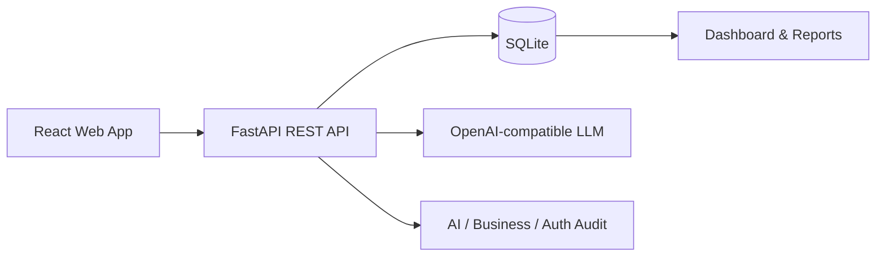

# Smart CRM

[Simplified Chinese](README.md) | [English](README.en.md)

Smart CRM is a **web-based intelligent sales management system** built for a software engineering course project. It uses React + FastAPI + SQLite to deliver a complete sales workflow, with AI Sales Copilot, intelligent order capture, customer health profiles, sales reports, permission control, and audit trails.

> Current delivery scope: Web management console + FastAPI backend. Team members can start both services by following this guide.

## Highlights

| Module | Implemented Capabilities |
|---|---|
| Sales Management | Accounts, contacts, leads/opportunities, products, orders, cases, tasks, sales goals |
| AI Copilot | Opportunity scoring, customer health profile, follow-up suggestions, business Q&A, recommendation-to-task, human feedback |
| Intelligent Order Capture | Extract order drafts from text or images, review manually, submit real orders, deduct inventory |
| Reporting | Dashboard, sales performance, approval SLA, business snapshots, AI quality metrics |
| Permission & Audit | Bearer sessions, RBAC, owner-scoped sales data, AI audit, business audit, authentication audit |
| Delivery Verification | Seed demo data, environment doctor, API smoke test, UI smoke test, frontend/backend automated tests |

## Tech Stack

| Layer | Stack |
|---|---|
| Frontend | React 19, Vite, lucide-react |
| Backend | FastAPI, SQLModel, SQLite |
| AI | OpenAI-compatible API, DeepSeek-compatible config, deterministic fallback |
| Test | node:test, pytest, Playwright smoke |



## Quick Start

### 1. Requirements

- Node.js 20+
- npm 10+
- Python 3.12
- Chrome, only required for `npm run smoke:ui`

### 2. Backend

```powershell
cd <SMART_CRM_ROOT>\backend

py -3.12 -m venv .venv
.\.venv\Scripts\python.exe -m pip install -r requirements.txt

Copy-Item .env.example .env
.\.venv\Scripts\python.exe -m app.manage reset-db
.\.venv\Scripts\python.exe -m app.manage doctor
.\.venv\Scripts\python.exe -m uvicorn app.main:app --host 127.0.0.1 --port 8000 --reload
```

Backend health check:

```text
http://127.0.0.1:8000/api/health
```

### 3. Frontend

Open another terminal:

```powershell
cd <SMART_CRM_ROOT>

npm install
Copy-Item .env.example .env
npm run dev -- --host 127.0.0.1 --port 5173
```

Open:

```text
http://127.0.0.1:5173
```

## Demo Accounts

All seed accounts use the same password: `SmartCRM@2026`.

| Role | Account |
|---|---|
| Admin | `demo@smart-crm.local` |
| Sales Manager | `manager@smart-crm.local` |
| Sales | `sales@smart-crm.local` |
| Support | `support@smart-crm.local` |
| Auditor | `audit@smart-crm.local` |

Recommended demo route:

1. Log in as Admin.
2. Open Dashboard and Notification Center.
3. Open Accounts, Customer 360, Orders, Sales Reports.
4. Open AI Copilot and ask a sales question.
5. Convert a Copilot recommendation to a task.
6. Open AI Audit, Business Audit, Permission Matrix.
7. Log in as Sales to show owner-scoped data.

## Environment

Root `.env` is used by Vite:

```env
VITE_API_BASE_URL=http://127.0.0.1:8000
```

Backend `.env` is used by FastAPI:

```env
SMART_CRM_CORS_ORIGINS=["http://localhost:5173","http://127.0.0.1:5173"]
SMART_CRM_DATABASE_URL=sqlite:///./smart_crm.db
SMART_CRM_LLM_BASE_URL=https://api.deepseek.com
SMART_CRM_LLM_API_KEY=
SMART_CRM_LLM_MODEL=deepseek-v4-flash
SMART_CRM_LLM_VISION_MODEL=
SMART_CRM_LLM_TIMEOUT_SECONDS=20
```

The LLM key is optional. Without a key, Copilot and intelligent capture still work through deterministic fallback results. Do not commit `.env`.

## Verification

Run these before a classroom demo:

```powershell
cd <SMART_CRM_ROOT>
npm run lint
npm test -- --run
npm run build
```

```powershell
cd <SMART_CRM_ROOT>\backend
.\.venv\Scripts\python.exe -m pytest
.\.venv\Scripts\python.exe -m app.manage doctor
```

After both services are running:

```powershell
cd <SMART_CRM_ROOT>
.\backend\.venv\Scripts\python.exe .\scripts\smoke_api.py --base-url http://127.0.0.1:8000
npm run smoke:ui -- --frontend-url http://127.0.0.1:5173 --api-url http://127.0.0.1:8000
```

To include the AI Copilot page in browser smoke:

```powershell
npm run smoke:ui -- --frontend-url http://127.0.0.1:5173 --api-url http://127.0.0.1:8000 --include-ai-page
```

## Demo Data

Reset the standard classroom database:

```powershell
cd <SMART_CRM_ROOT>\backend
.\.venv\Scripts\python.exe -m app.manage reset-db
.\.venv\Scripts\python.exe -m app.manage doctor
```

`doctor` checks table structure, seed data scale, LLM config, and cross-table consistency. A healthy demo database includes 12 customers, 10 products, 15 leads/opportunities, 12 orders, 22 order items, and 0 consistency issues.

Backup or restore a local SQLite demo snapshot:

```powershell
.\.venv\Scripts\python.exe -m app.manage backup-db .\backups
.\.venv\Scripts\python.exe -m app.manage restore-db .\backups\smart_crm_backup_YYYYMMDD-HHMMSS.db
.\.venv\Scripts\python.exe -m app.manage doctor
```

`backend/backups/` is ignored by Git.

## Project Structure

```text
smart-crm/
├─ src/                 React + Vite frontend
├─ public/              frontend static assets
├─ backend/             FastAPI backend and SQLite tooling
├─ scripts/             API smoke, UI smoke, screenshot helpers
├─ docs/                deployment guide and dev logs
├─ README.md            Chinese guide
└─ README.en.md         English guide
```

## More Docs

- Detailed deployment: `docs/deployment.md`
- Engineering logs: `docs/dev-log/`
- Report package: `<REPORT_ROOT>`
