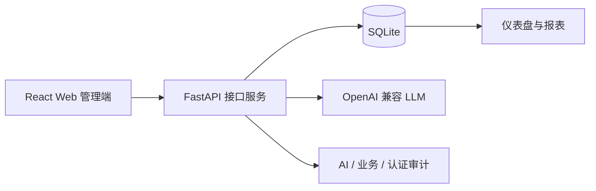

# Smart CRM

[简体中文](README.md) | [English](README.en.md)

Smart CRM 是一个面向课程设计演示的 **Web 端智能销售管理系统**。系统使用 React + FastAPI + SQLite 实现销售管理闭环，并加入 AI Sales Copilot、智能录单、客户健康画像、销售报表、权限控制和审计留痕。

> 当前交付范围：Web 管理端 + FastAPI 后端。小组成员只需要按本文档启动前后端即可完成演示。

## 项目亮点

| 模块 | 已实现能力 |
|---|---|
| 销售管理 | 客户、联系人、线索/商机、商品、订单、工单、任务、销售目标 |
| AI Copilot | 商机评分、客户健康画像、跟进建议、经营问答、推荐转任务、人工反馈 |
| 智能录单 | 文本/图片抽取订单草稿、人工复核、提交真实订单、库存扣减 |
| 报表分析 | 仪表盘、销售绩效、审批 SLA、经营快照、AI 质量统计 |
| 权限审计 | 登录会话、RBAC、销售 owner 数据范围、AI 审计、业务审计、认证审计 |
| 交付验证 | 演示数据 seed、环境 doctor、API smoke、UI smoke、前后端自动测试 |

## 技术栈

| 层级 | 技术选型 |
|---|---|
| 前端 | React 19, Vite, lucide-react |
| 后端 | FastAPI, SQLModel, SQLite |
| AI | OpenAI-compatible API, DeepSeek-compatible config, deterministic fallback |
| 测试 | node:test, pytest, Playwright smoke |



## 快速启动

### 1. 环境要求

- Node.js 20+
- npm 10+
- Python 3.12
- Chrome，仅运行 `npm run smoke:ui` 时需要

### 2. 启动后端

```powershell
cd <SMART_CRM_ROOT>\backend

py -3.12 -m venv .venv
.\.venv\Scripts\python.exe -m pip install -r requirements.txt

Copy-Item .env.example .env
.\.venv\Scripts\python.exe -m app.manage reset-db
.\.venv\Scripts\python.exe -m app.manage doctor
.\.venv\Scripts\python.exe -m uvicorn app.main:app --host 127.0.0.1 --port 8000 --reload
```

后端健康检查：

```text
http://127.0.0.1:8000/api/health
```

### 3. 启动前端

打开另一个终端：

```powershell
cd <SMART_CRM_ROOT>

npm install
Copy-Item .env.example .env
npm run dev -- --host 127.0.0.1 --port 5173
```

浏览器打开：

```text
http://127.0.0.1:5173
```

## 演示账号

所有演示账号使用同一个密码：`SmartCRM@2026`。

| 角色 | 账号 |
|---|---|
| 管理员 | `demo@smart-crm.local` |
| 销售经理 | `manager@smart-crm.local` |
| 销售人员 | `sales@smart-crm.local` |
| 客服人员 | `support@smart-crm.local` |
| 审计人员 | `audit@smart-crm.local` |

推荐演示路线：

1. 使用管理员账号登录。
2. 打开仪表盘和通知中心。
3. 查看客户、客户 360、订单和销售报表。
4. 打开 AI Copilot，输入销售经营问题。
5. 将一条 Copilot 推荐转为真实任务。
6. 查看 AI 审计、业务审计和权限矩阵。
7. 切换销售人员账号，展示仅能查看本人负责数据的数据范围控制。

## 环境变量

根目录 `.env` 供 Vite 前端使用：

```env
VITE_API_BASE_URL=http://127.0.0.1:8000
```

后端 `.env` 供 FastAPI 使用：

```env
SMART_CRM_CORS_ORIGINS=["http://localhost:5173","http://127.0.0.1:5173"]
SMART_CRM_DATABASE_URL=sqlite:///./smart_crm.db
SMART_CRM_LLM_BASE_URL=https://api.deepseek.com
SMART_CRM_LLM_API_KEY=
SMART_CRM_LLM_MODEL=deepseek-v4-flash
SMART_CRM_LLM_VISION_MODEL=
SMART_CRM_LLM_TIMEOUT_SECONDS=20
```

LLM key 是可选项。没有配置 key 时，Copilot 和智能录单仍会使用确定性兜底结果，方便课堂演示和离线验收。不要提交 `.env`。

## 验证命令

课堂演示前建议运行：

```powershell
cd <SMART_CRM_ROOT>
npm run lint
npm test -- --run
npm run build
```

```powershell
cd <SMART_CRM_ROOT>\backend
.\.venv\Scripts\python.exe -m pytest
.\.venv\Scripts\python.exe -m app.manage doctor
```

前后端都启动后，可以运行接口和浏览器冒烟测试：

```powershell
cd <SMART_CRM_ROOT>
.\backend\.venv\Scripts\python.exe .\scripts\smoke_api.py --base-url http://127.0.0.1:8000
npm run smoke:ui -- --frontend-url http://127.0.0.1:5173 --api-url http://127.0.0.1:8000
```

如果需要把 AI Copilot 页面也纳入浏览器冒烟测试：

```powershell
npm run smoke:ui -- --frontend-url http://127.0.0.1:5173 --api-url http://127.0.0.1:8000 --include-ai-page
```

## 演示数据

重置标准课堂演示数据库：

```powershell
cd <SMART_CRM_ROOT>\backend
.\.venv\Scripts\python.exe -m app.manage reset-db
.\.venv\Scripts\python.exe -m app.manage doctor
```

`doctor` 会检查表结构、演示数据规模、LLM 配置和跨表一致性。健康的演示数据库包含 12 个客户、10 个商品、15 条线索/商机、12 个订单、22 条订单明细，并且一致性问题为 0。

备份或恢复本地 SQLite 演示快照：

```powershell
.\.venv\Scripts\python.exe -m app.manage backup-db .\backups
.\.venv\Scripts\python.exe -m app.manage restore-db .\backups\smart_crm_backup_YYYYMMDD-HHMMSS.db
.\.venv\Scripts\python.exe -m app.manage doctor
```

`backend/backups/` 已被 Git 忽略，不会提交到仓库。

## 项目结构

```text
smart-crm/
├─ src/                 React + Vite 前端源码
├─ public/              前端静态资源
├─ backend/             FastAPI 后端和 SQLite 工具
├─ scripts/             API 冒烟、UI 冒烟和截图辅助脚本
├─ docs/                部署说明和开发日志
├─ README.md            中文说明
└─ README.en.md         英文说明
```

## 更多文档

- 详细部署说明：`docs/deployment.md`
- 开发日志：`docs/dev-log/`
- 课程报告包：`<REPORT_ROOT>`
