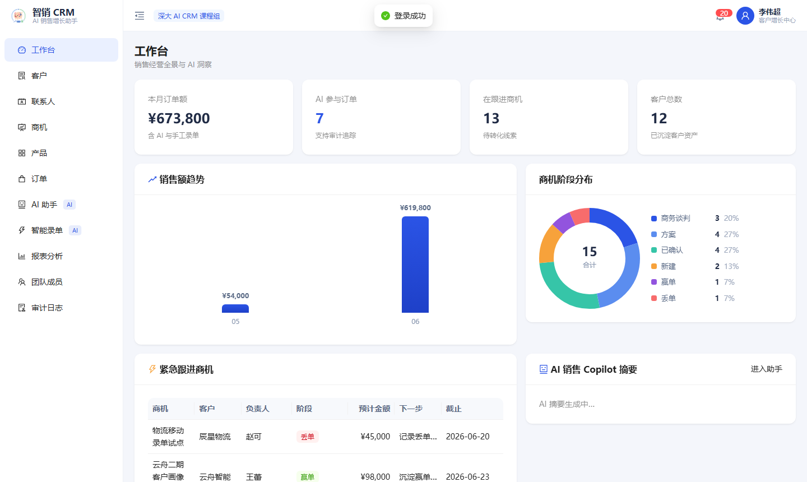
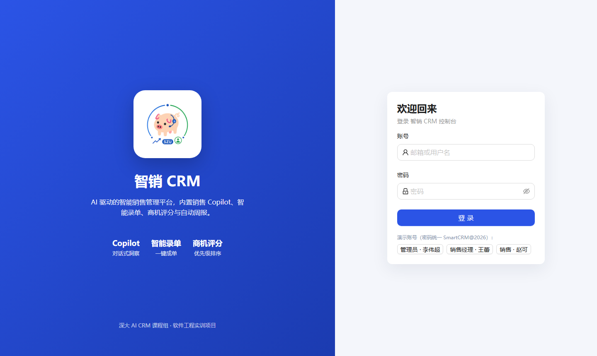
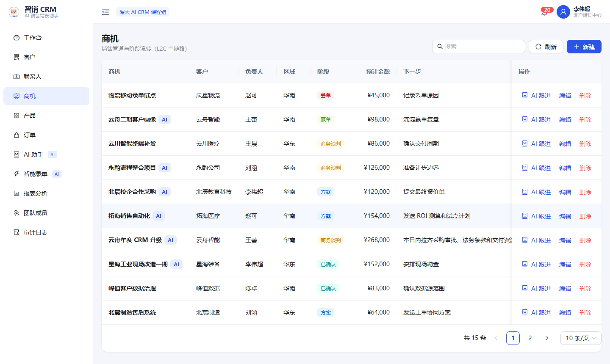
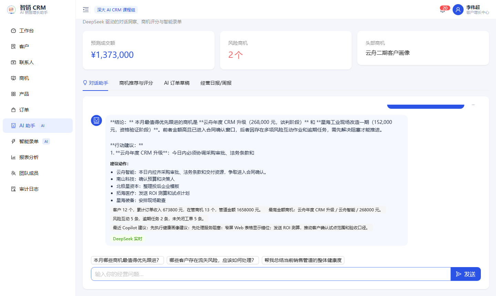
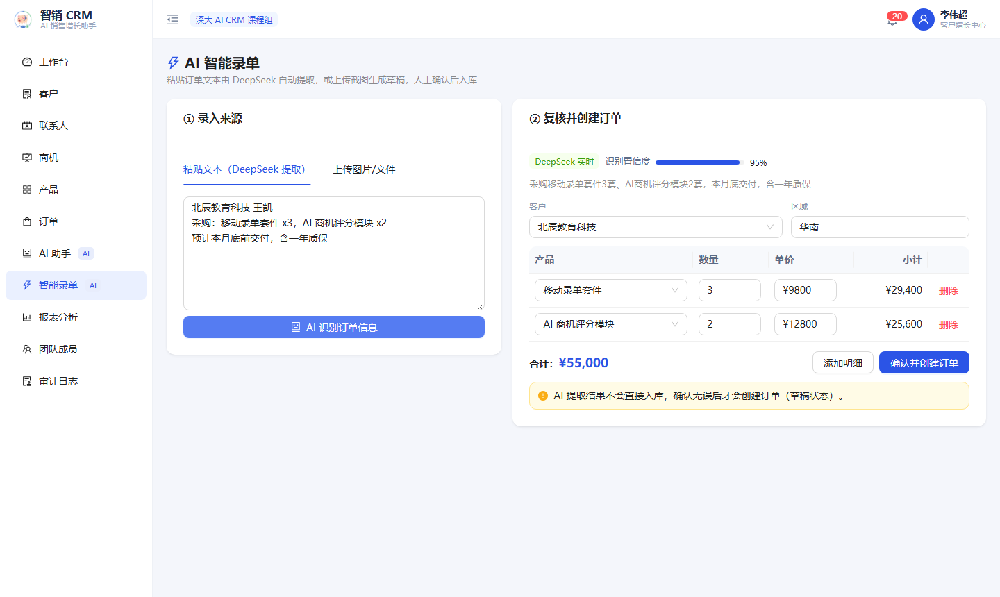
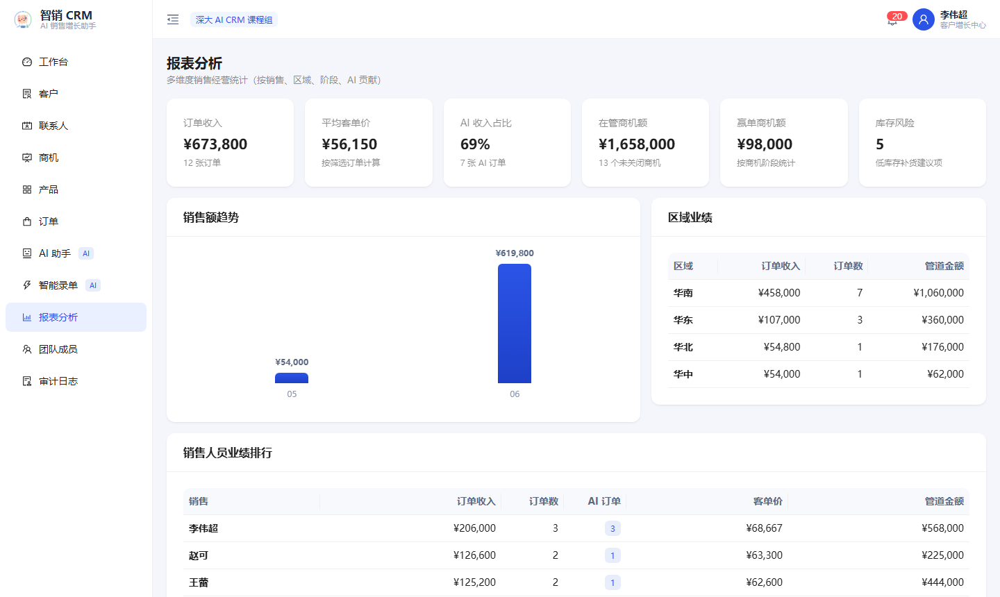

<div align="center">

# 智销 CRM · Smart CRM

**AI 驱动的智能销售管理系统**

线索到回款全链路管理 · 内置销售 Copilot、智能录单、商机评分与经营日报

React 19 · Ant Design · FastAPI · SQLite · DeepSeek

</div>



## 简介

智销 CRM 是一个前后端分离的智能销售管理系统，覆盖**客户、联系人、商机、产品、订单**的完整销售流程，并在传统 CRM 的基础上引入由 **DeepSeek 大模型**驱动的 AI 能力：自然语言经营问答、商机智能评分与跟进建议、智能录单、经营日报/周报自动生成。所有 AI 调用经后端编排并全程留痕，模型不可用时自动降级为本地结果。

## ✨ 功能特性

- **销售主流程**：客户 / 联系人 / 商机（阶段流转）/ 产品 / 订单 / 订单审批，数据全部持久化到后端。
- 🤖 **AI 销售 Copilot**：基于真实 CRM 数据的经营问答，给出结论、行动建议与数据佐证。
- ⚡ **智能录单**：粘贴订单文本或上传截图，自动提取客户与商品明细生成草稿，人工确认后才入库。
- 🎯 **商机智能评分**：规则评分 + 大模型建议，输出等级、赢率与下一步最佳动作，可一键转跟进任务。
- 📝 **经营日报 / 周报**：一键基于实时数据生成结构化经营报告。
- 📊 **多维报表**：工作台 KPI、销售额趋势、商机阶段分布、销售人员与区域业绩、AI 贡献占比。
- 🔐 **权限与审计**：RBAC 角色权限、销售 owner 数据范围隔离、AI / 业务 / 认证三类审计留痕。
- 🛟 **AI 全程降级**：模型不可用或离线时自动回退本地结果，演示永不"开天窗"。

## 🖼️ 界面预览

| 登录 | 商机管道 |
| --- | --- |
|  |  |

| AI 销售 Copilot | 智能录单 |
| --- | --- |
|  |  |

| 报表分析 |
| --- |
|  |

## 🛠️ 技术栈

| 层级 | 技术 |
| --- | --- |
| 前端 | React 19、Vite、React Router、Ant Design |
| 后端 | Python 3.12、FastAPI、SQLModel、Uvicorn |
| 数据库 | SQLite（经 SQLModel 访问，可平滑切换 PostgreSQL / MySQL） |
| AI | DeepSeek（OpenAI 兼容接口，`deepseek-v4-flash`） |
| 测试 | pytest（后端）、node:test（前端） |

## 🚀 快速开始

> 需要 Node.js 20+、Python 3.12、Git。

### 1. 克隆

```bash
git clone https://github.com/liweichao-coder/smart-crm.git
cd smart-crm
```

### 2. 启动后端（端口 8000）

```powershell
cd backend
py -3.12 -m venv .venv
.\.venv\Scripts\python.exe -m pip install -r requirements.txt
Copy-Item .env.example .env
.\.venv\Scripts\python.exe -m app.manage reset-db
.\.venv\Scripts\python.exe -m uvicorn app.main:app --host 127.0.0.1 --port 8000
```

### 3. 启动前端（端口 5173）

```powershell
# 新开一个终端，回到项目根目录
npm install
Copy-Item .env.example .env
npm run dev
```

浏览器打开 <http://127.0.0.1:5173>。

### 4. 配置 DeepSeek（可选，启用真实 AI）

到 DeepSeek 开放平台 <https://platform.deepseek.com> 申请一个 API Key，填入 `backend/.env` 的 `SMART_CRM_LLM_API_KEY=`，重启后端即可。**不配置也能运行**，AI 会自动降级为本地结果。请勿将 key 提交到仓库。

## 🔑 演示账号

密码统一为 `SmartCRM@2026`（登录页提供快捷填充按钮）。

| 角色 | 账号 | 数据范围 |
| --- | --- | --- |
| 管理员 | `demo@smart-crm.local` | 全部数据 |
| 销售 | `sales@smart-crm.local` | 仅本人负责 |

## 🧪 测试

```powershell
# 后端
cd backend
.\.venv\Scripts\python.exe -m pytest

# 前端
npm test
```

## 📁 目录结构

```text
smart-crm/
├─ src/           前端源码（React + Vite + Ant Design）
│  ├─ pages/      各业务页面
│  ├─ layouts/    布局
│  └─ components/ 通用组件
├─ backend/       FastAPI 后端 + SQLite
│  └─ app/        models / schemas / services / main
├─ screenshots/   界面预览图
└─ README.md
```
