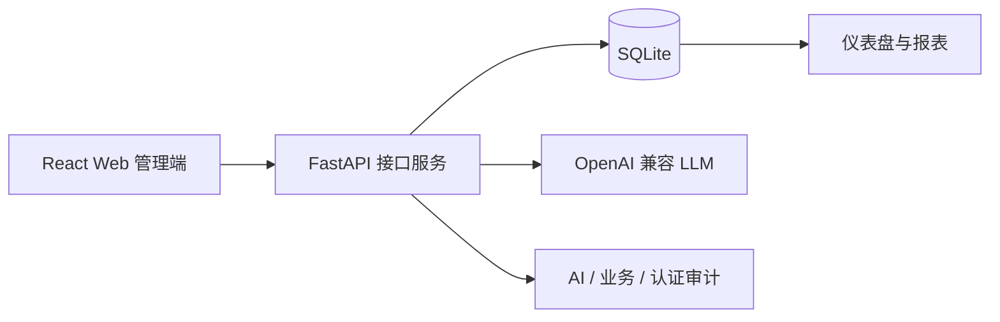

# Smart CRM

[简体中文](README.md) | [English](README.en.md)

Smart CRM 是一个面向课程设计演示的 **Web 端智能销售管理系统**。项目参考 CordysCRM 等智能 CRM 产品的 L2C、工作台、CRM Skills 和 BI 思路，但代码、数据模型、页面和演示流程均围绕课程要求自研实现。系统使用 React + FastAPI + SQLite 跑通销售主流程，并加入 AI Sales Copilot、智能录单、客户健康画像、销售报表、权限控制和审计留痕。

> 当前交付范围：Web 管理端 + FastAPI 后端。验收重点是简单 CRM 主流程 + AI 亮点 + 真实后端闭环，不追求覆盖完整大型 CRM 的全部场景。

## 项目亮点

| 模块 | 已实现能力 |
|---|---|
| 销售管理 | 客户、联系人、线索/商机、商品、订单、工单、任务、销售目标 |
| AI Copilot | 商机评分、客户健康画像、跟进建议、经营问答、推荐转任务、人工反馈 |
| 智能录单 | 文本/图片抽取订单草稿、人工复核、提交真实订单、库存扣减 |
| 报表分析 | 仪表盘、销售绩效、审批 SLA、经营快照、AI 质量统计 |
| 权限审计 | 登录会话、RBAC、销售 owner 数据范围、AI 审计、业务审计、认证审计 |
| 交付验证 | 演示数据 seed、环境 doctor、前后端自动测试 |

## 技术栈

| 层级 | 技术选型 |
|---|---|
| 前端 | React 19, Vite, Ant Design |
| 后端 | FastAPI, SQLModel, SQLite |
| AI | OpenAI-compatible API, DeepSeek-compatible config, deterministic fallback |
| 测试 | node:test, pytest |



## 快速启动

> 演示由组员在另一台电脑上进行时，请完整按本节从 0 到 3 操作；数据库与 `.env` 不在仓库里，需要在本机生成。

### 0. 在新电脑上首次部署（演示机）

1. 安装好下列环境（见 1 环境要求），并安装 Git。
2. 克隆仓库：
   ```powershell
   git clone git@github.com:liweichao-coder/smart-crm.git
   cd smart-crm
   ```
   （没有配置 SSH 时用 HTTPS：`git clone https://github.com/liweichao-coder/smart-crm.git`）
3. 按下面"2 启动后端""3 启动前端"操作即可。数据库会在 `reset-db` 时自动生成演示数据。
4. **AI 真实功能需要 DeepSeek 密钥（请自行申请）**：到 DeepSeek 开放平台 <https://platform.deepseek.com> 注册并创建一个 API Key，填入 `backend\.env` 的 `SMART_CRM_LLM_API_KEY=`。
   不填也能运行和演示，AI 会自动降级为本地结果（界面标"本地降级"）；要展示真实大模型效果就必须填。**每人用自己的 key，切勿把 key 提交到仓库。**

### 1. 环境要求

- Node.js 20+
- npm 10+
- Python 3.12
- Chrome / Edge（演示用浏览器）

### 2. 启动后端

```powershell
cd <SMART_CRM_ROOT>\backend

py -3.12 -m venv .venv
.\.venv\Scripts\python.exe -m pip install -r requirements.txt

Copy-Item .env.example .env
.\.venv\Scripts\python.exe -m app.manage reset-db
.\.venv\Scripts\python.exe -m app.manage doctor
.\.venv\Scripts\python.exe -m uvicorn app.main:app --host 127.0.0.1 --port 8000 --reload
```

后端健康检查：

```text
http://127.0.0.1:8000/api/health
```

### 3. 启动前端

打开另一个终端：

```powershell
cd <SMART_CRM_ROOT>

npm install
Copy-Item .env.example .env
npm run dev -- --host 127.0.0.1 --port 5173
```

浏览器打开：

```text
http://127.0.0.1:5173
```

## 演示账号

所有演示账号使用同一个密码：`SmartCRM@2026`。

| 角色 | 账号 |
|---|---|
| 管理员 | `demo@smart-crm.local` |
| 销售经理 | `manager@smart-crm.local` |
| 销售人员 | `sales@smart-crm.local` |
| 客服人员 | `support@smart-crm.local` |
| 审计人员 | `audit@smart-crm.local` |

推荐演示路线（对应左侧菜单顺序）：

1. 用管理员账号登录（登录页可点演示账号按钮快捷填充）。
2. **工作台**：查看 KPI、销售额趋势、商机阶段分布、紧急跟进商机与 AI Copilot 摘要。
3. **客户 / 联系人**：展示客户分级、负责人与增删改查。
4. **商机**：展示阶段流转，点行内"AI 跟进"演示大模型生成的跟进话术。
5. **AI 助手**：在"对话助手"提问（如"本月哪些商机最值得优先跟进？"），展示基于真实数据的回答；再看"商机推荐与评分""AI 订单草稿""经营日报/周报"。
6. **智能录单**：在"粘贴文本"输入订单文字 → 点"AI 识别订单信息" → 复核 → "确认并创建订单"。
7. **订单**：展开订单明细，确认刚才录入的订单已落库、带 AI 标记。
8. **报表分析**：展示多维度销售统计。
9. **审计日志 → AI 审计**：展示每次真实大模型调用记录（模型、耗时、是否降级），作为 AI 真实接入的证据。

补充：可切换销售账号 `sales@smart-crm.local` 登录，演示销售只能看到本人负责数据的范围控制。

## 环境变量

根目录 `.env` 供 Vite 前端使用：

```env
VITE_API_BASE_URL=http://127.0.0.1:8000
```

后端 `.env` 供 FastAPI 使用：

```env
SMART_CRM_CORS_ORIGINS=["http://localhost:5173","http://127.0.0.1:5173"]
SMART_CRM_CORS_ORIGIN_REGEX=^https?://(localhost|127\.0\.0\.1):[0-9]+$
SMART_CRM_DATABASE_URL=sqlite:///./smart_crm.db
SMART_CRM_LLM_BASE_URL=https://api.deepseek.com
SMART_CRM_LLM_API_KEY=
SMART_CRM_LLM_MODEL=deepseek-v4-flash
SMART_CRM_LLM_VISION_MODEL=
SMART_CRM_LLM_TIMEOUT_SECONDS=20
```

LLM key 是可选项。没有配置 key 时，Copilot 和智能录单仍会使用确定性兜底结果，方便课堂演示和离线验收。不要提交 `.env`。

## 验证命令

验收时优先确认三件事：前后端可以启动，主展示路径可以完整走通，关键数据来自 FastAPI + SQLite 后端而不是前端静态数据。

课堂演示前建议运行：

```powershell
cd <SMART_CRM_ROOT>
npm run lint
npm test -- --run
npm run build
```

```powershell
cd <SMART_CRM_ROOT>\backend
.\.venv\Scripts\python.exe -m pytest
.\.venv\Scripts\python.exe -m app.manage doctor
```

## 演示数据

重置标准课堂演示数据库：

```powershell
cd <SMART_CRM_ROOT>\backend
.\.venv\Scripts\python.exe -m app.manage reset-db
.\.venv\Scripts\python.exe -m app.manage doctor
```

`doctor` 会检查表结构、演示数据规模、LLM 配置和跨表一致性。健康的演示数据库包含 12 个客户、10 个商品、15 条线索/商机、12 个订单、22 条订单明细，并且一致性问题为 0。

备份或恢复本地 SQLite 演示快照：

```powershell
.\.venv\Scripts\python.exe -m app.manage backup-db .\backups
.\.venv\Scripts\python.exe -m app.manage restore-db .\backups\smart_crm_backup_YYYYMMDD-HHMMSS.db
.\.venv\Scripts\python.exe -m app.manage doctor
```

`backend/backups/` 已被 Git 忽略，不会提交到仓库。

## 项目结构

```text
smart-crm/
├─ src/                 React + Vite 前端源码
├─ public/              前端静态资源
├─ backend/             FastAPI 后端和 SQLite 工具
├─ README.md            中文说明
└─ README.en.md         英文说明
```

## 更多文档

- 课程报告包：`<REPORT_ROOT>`
